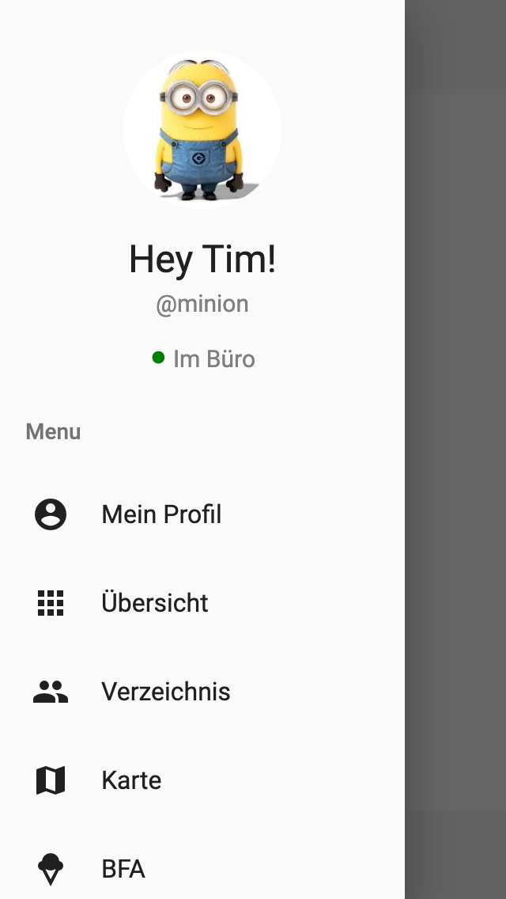
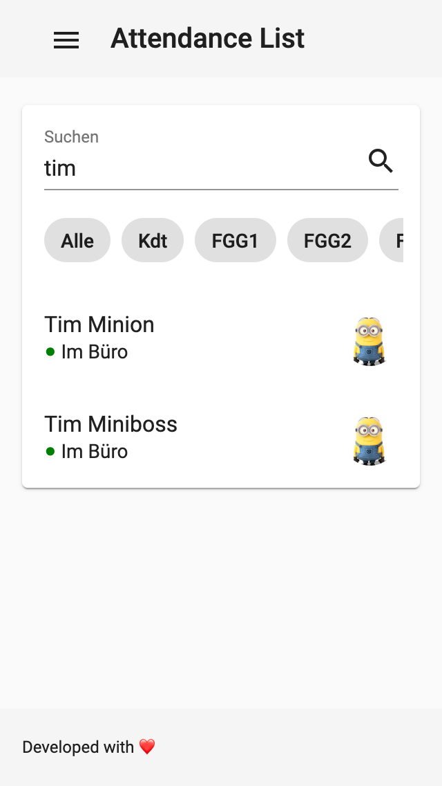
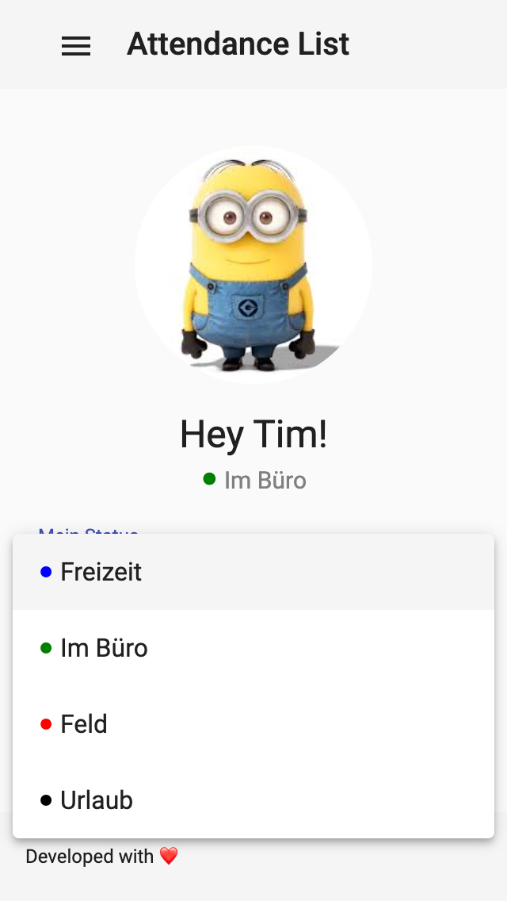
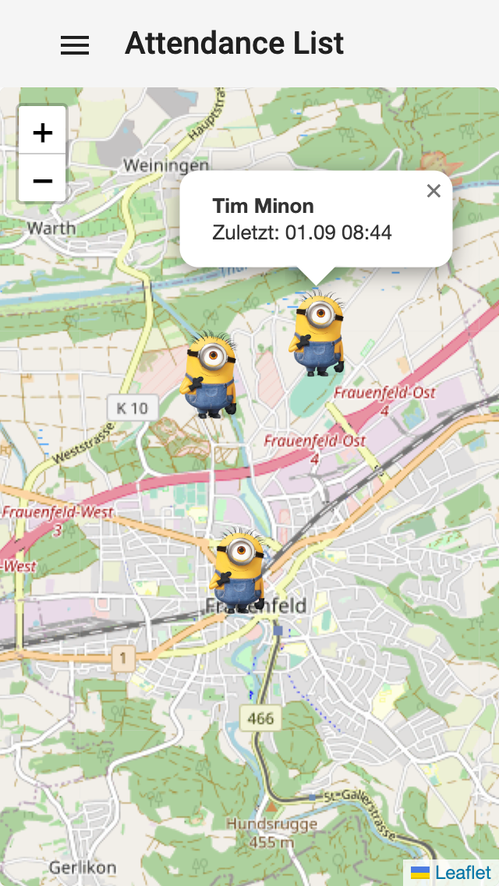
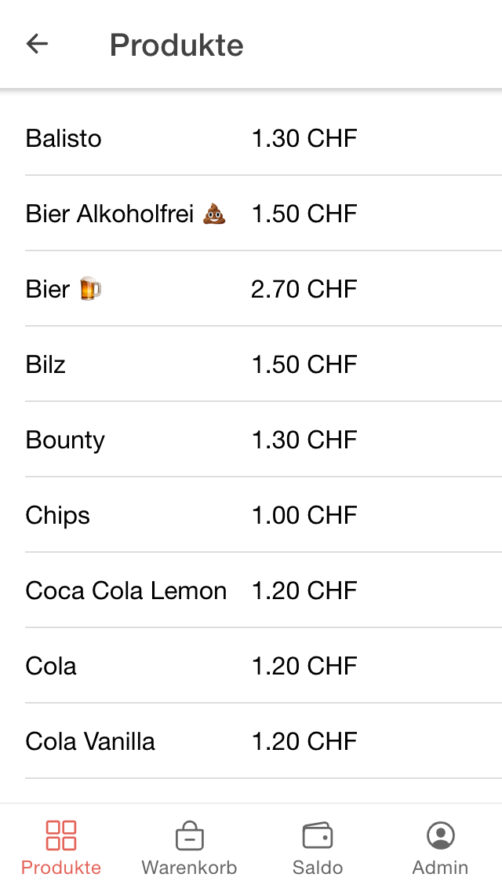
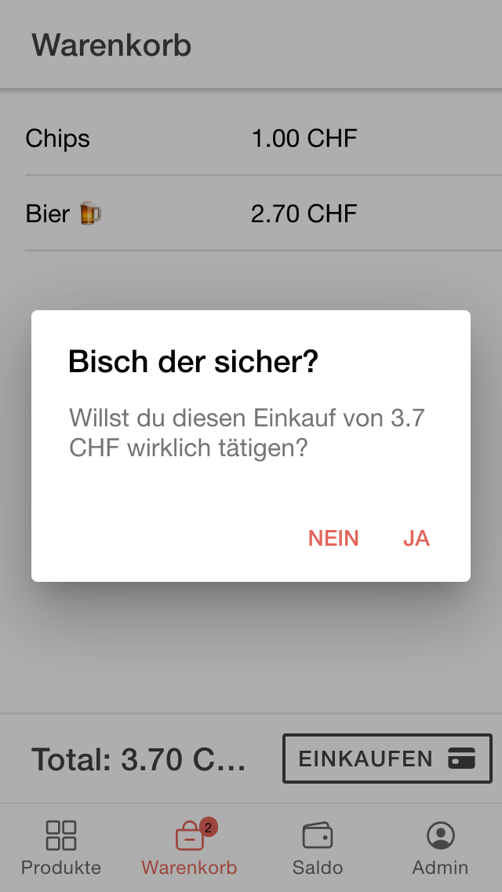
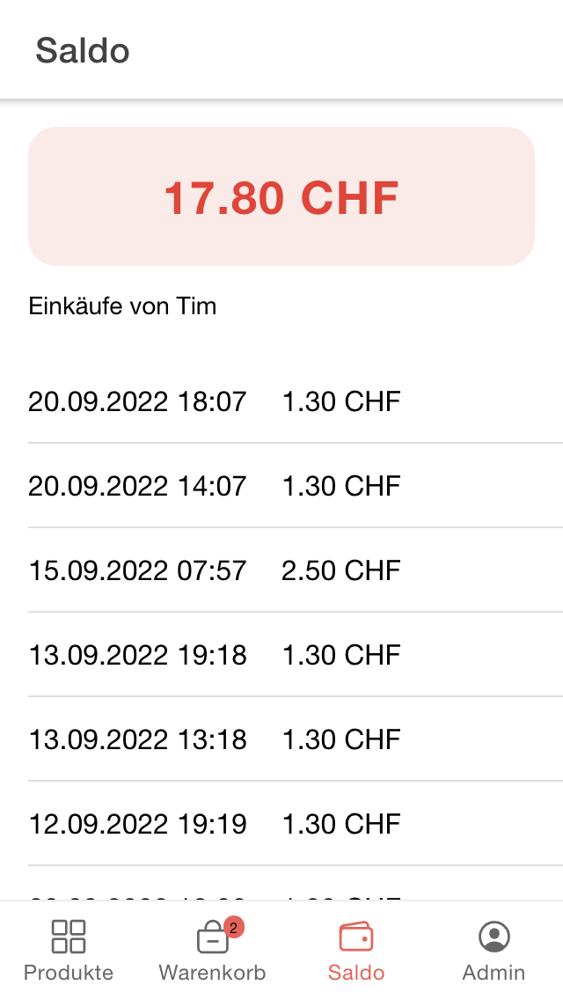
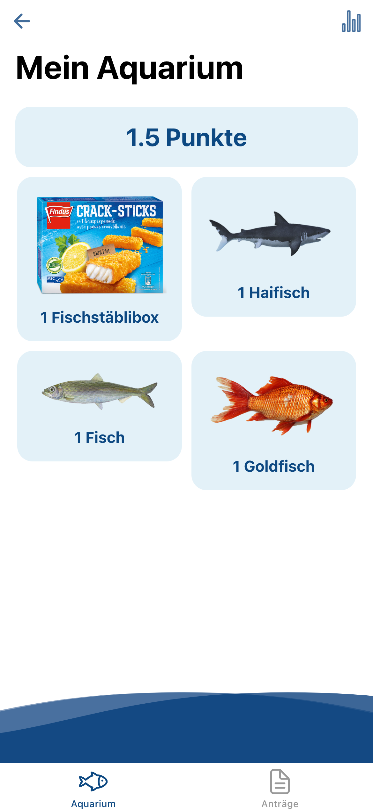
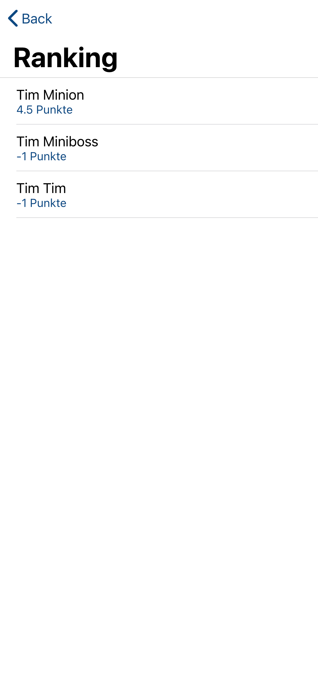
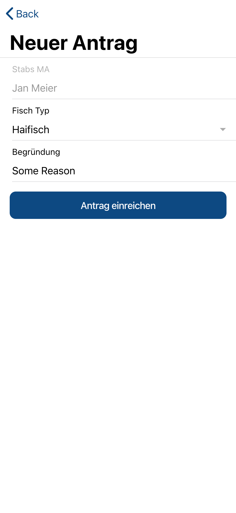

# Attendance List / BFA / Fischmarkt
This repo contains 3 frontend components and 1 backend component. 

<b>List of frontend components:</b>
- <a href="https://github.com/biersoeckli/attendance-list/tree/master/attendance-list">Attendance List (this repo)</a>
- <a href="https://github.com/biersoeckli/attendance-list/tree/master/bfa">BFA (Bataillonsinterner Finanzausgleich)</a>
- <a href="https://github.com/biersoeckli/attendance-list/tree/master/fischmarkt">Fischmarkt</a>

<b>Backend component:</b>
- <a href="https://github.com/biersoeckli/attendance-list/tree/master/parse-server">Backend Parse Server (including Parse-Dashboard)</a>

# Deployment

To deploy the application this <a href="https://hub.docker.com/repository/docker/biersoeckli/attendance-list/general">Docker Image</a> can be used. It contains frontend and backend. The frontend components are served on the root path. The backend is served on the path `/parse`. The Parse Dashboard is served on the path `/dashboard`. The backend can be configured with the following environment variables:

- DATABASE_URI= The URI to the MongoDB database
- MASTER_KEY= The master key for the Parse Server
- APP_ID= should be "attendance-list"
- SERVER_URL= The root hostname where the backend is served for example: https://example.com
- DASHBOARD_PASSWORT= The password for the dashboard login

# Attendance List

## What's this?
The "Attendance List" is a system to visualise all registrated users with their current location on a map. Alternatively, each user can set a location status (Office, Out Of Office, Holiday, Leisure Time). It was originally created to have an overview of the location from all members of a Stab in a Swiss Army Bataillon.

## Preview
<table>
  <tr>
    <td>
      
    </td>
    <td>
      
    </td>
    <td>
      
    </td>
    <td>
      
    </td>
  </tr>
</table>

# BFA

## What's this?

The BFA is a Self-Checkout-Kiosk-System. It was originally created to purchase products at the internal <a href="https://www.vtg.admin.ch/de/mein-militaerdienst/allgemeines-zum-militaerdienst/dienstpflicht.html">WK</a>-Kiosk in a Swiss Army bataillon.

# Preview

<table>
  <tr>
    <td>
      
    </td>
    <td>
      
    </td>
    <td>
      
    </td>
  </tr>
</table>

# Fischmarkt

## What's this? (todo)

## Rules

The rules are defined in the this <a href="https://github.com/biersoeckli/attendance-list/blob/master/fischmarkt/src/assets/Fischerreglement_Spit_Bat_75.pdf">PDF</a> (German).

# Preview
<table>
  <tr>
    <td>
      
    </td>
    <td>
      
    </td>
    <td>
      
    </td>
  </tr>
</table>
