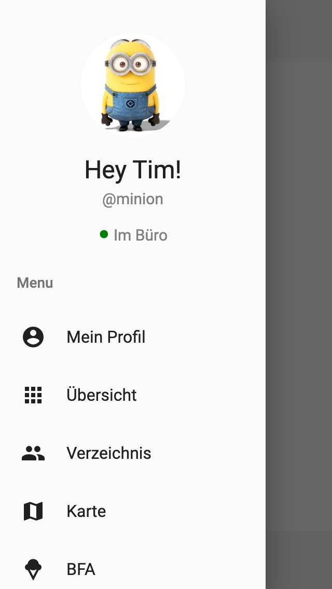
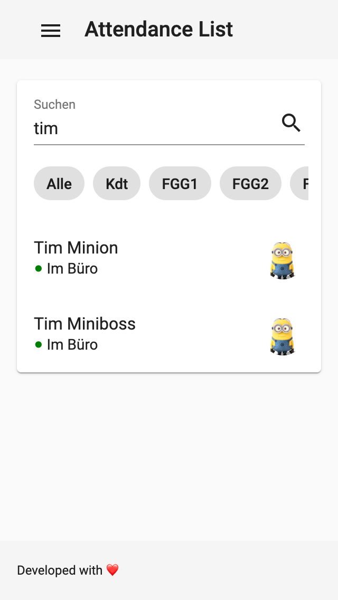

# Attendance List
This repo contains the main component (of total 3 components) including a parse-server backend (folder <a href="https://github.com/biersoeckli/attendance-list/tree/master/parse-server">parse-server</a>) and angular frontend (folder <a href="https://github.com/biersoeckli/attendance-list/tree/master/frontend">frontend</a>) for the attendance list. 

The attendance list is extendable with 2 other components (see below). All components are designed for mobile use only.

<b>List of all components:</b>
- <a href="https://github.com/biersoeckli/attendance-list">Attendance List (this repo)</a>
- <a href="https://github.com/biersoeckli/bfa">BFA (Bataillonsinterner Finanzausgleich)</a>
- <a href="https://github.com/biersoeckli/fischmarkt">Fischmarkt</a>

## What's this?
The "Attendance List" is a system to visualise all registrated users with their current location on a map. Alternatively, each user can set a location status (Office, Out Of Office, Holiday, Leisure Time). It was originally created to have an overview of the location from all members of a Stab in a Swiss Army Bataillon.

## Preview
<table>
  <tr>
    <td>
      
    </td>
    <td>
      
    </td>
    <td>
      
    </td>
    <td>
      
    </td>
  </tr>
</table>
